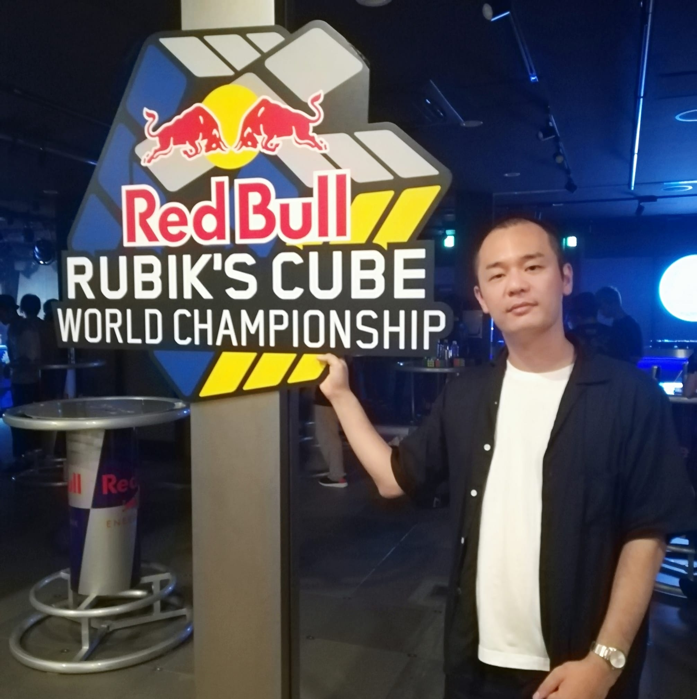
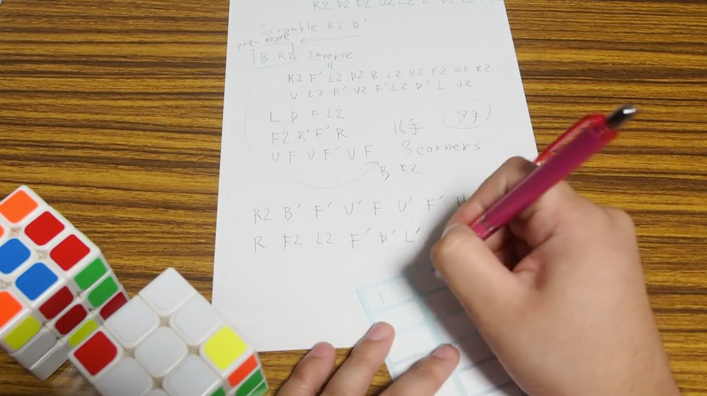
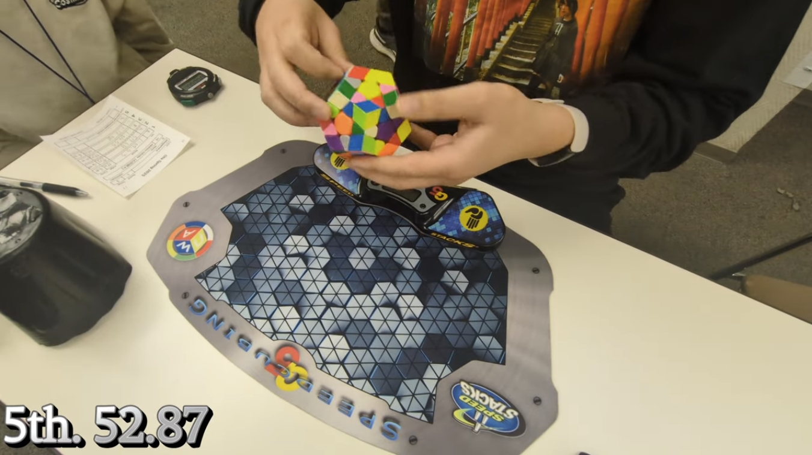
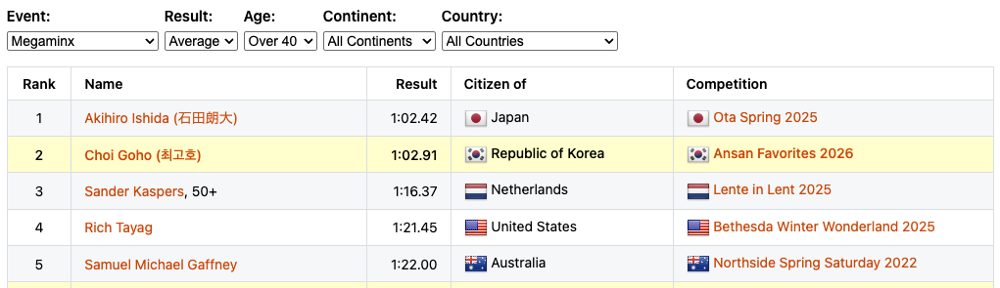

<!-- class: title-slide -->

## 第0部
# 自己紹介

---
<!-- class: "" -->

## 基本プロフィール

<strong>石田朗大（あきひろ） 41歳</strong>

2023年10月 豆蔵入社
ビジネスソリューション事業部 
アジャイルグループ

前職（小売業ユーザー企業）でスクラムに出会い、本格的にその道に進みたいと決意し、豆蔵に入社しました。

---

## 職務経歴
- <strong>2009.4 - 2017.3 独立系SIer</strong>
  - ウォーターフォール型での金融システム開発
- <strong>2017.4 - 2023.9 小売業 社内SE</strong>
  - 基幹システムの運用保守、刷新プロジェクト
- <strong>2023.10 - 現在 豆蔵 アジャイルグループ</strong>
  - 専任スクラムマスターとしてプロジェクトを支援

---

## 特技・趣味

<strong>ルービックキューブ</strong>

- 最少手数競技 アジア大会2014 3位
- メガミンクス シニア（40歳以上） 世界記録保持者
- 目隠しで揃えるための基本解法を日本に普及

---

## 最少手数競技

- ルービックキューブを<strong>どれだけ少ない手数で揃えられるか</strong>
- 1時間の制限時間で考えて、手順を紙に書いて提出する。
- アジア大会入賞時（2014年）の記録は<strong>31手</strong>
- 今の世界記録は<strong>16手</strong>

---

## メガミンクス

- 正十二面体の形をした立体パズル
- シニア部門（40歳以上）
  世界記録保持者：平均 <strong>1:02.42</strong>

---

## 今回の豆寄席について

私は元々開発エンジニアでしたが、現在は専任のスクラムマスターとして動いています。

- 生成AIが急激に進化し、コードを書く<strong>開発者</strong>の生産性を劇的に向上させています。
- コードを書かない<strong>スクラムマスター</strong>はどうAIを使うべきか？

この課題について、実際に私が現場で実践している内容をご紹介します。
