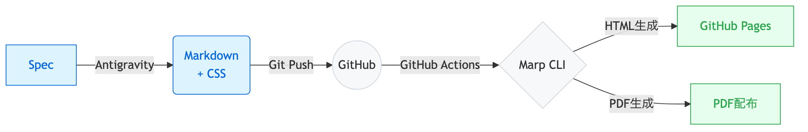

<!-- class: title-slide -->

# 非開発エンジニアによるその他のAI活用
## メイキング・個人での活用

---
<!-- class: "" -->

## このスライドの作り方 (メイキング)

このスライド資料自体も、生成AIを用いた<strong>仕様駆動開発 (SDD)</strong> により作成しました。

- 人間が直接Markdownファイルを記述するのではなく、AIエージェントに指示を与えて作成させている。
- <strong>いかにコードを書くか</strong>ではなく<strong>プロダクトにどう責任を持つか</strong>という、先ほどのまとめを体現する形となっている。

---

## スライド作成を支えるツール群

- <strong>GitHub Spec Kit</strong>
  - 設計やタスク等のドキュメントを管理するMarkdownベースのフレームワーク。
- <strong>Google Antigravity</strong>
  - 設計書をもとに、自律的にコードや資料を生成するエージェント型AI。
- <strong>Marp</strong>
  - Markdownファイルから、美しいスライド形式のHTMLやPDFを生成するツール。
- <strong>Primer CSS</strong>
  - Marpのテーマとして使用するCSSフレームワーク。

---

## 仕様駆動開発による作成フロー

以下の流れで、設計からデプロイまでを自動化している。

1. <strong>Spec Kit</strong>でスライドの構成やタスクを設計。
2. <strong>Antigravity</strong>で設計書をもとにMarkdownを生成。
3. <strong>Marp</strong>と<strong>Primer CSS</strong>でスライドデザインを適用しデプロイ。

---

## GitHub Spec Kitの構成要素

Spec Kitの特徴は、AIに与える情報を役割ごとに分割管理することである。主に以下の4つのドキュメントを用いる。

- <strong>Constitution (規約)</strong>
  - 全体で守るべきルールやトーン＆マナー（制約条件）を定義。
- <strong>Spec (仕様書)</strong>
  - ユーザーストーリーなどの<strong>何を作るか（What）</strong>を定義。
- <strong>Plan (計画・設計)</strong>
  - 仕様をどう実装するか（How）という技術的アプローチを定義。
- <strong>Tasks (タスク一覧)</strong>
  - 手順のブレイクダウンとトラッキング（進捗管理）を行う。

---

## Spec Kitでプレゼン資料を作成するメリット

プロンプトにチャットで依頼する場合と比較し、AIと連携してプレゼン資料を作成する上で以下のようなメリットがある。

- <strong>フォーマットとデザインの一貫性</strong>
  - AIが設定されたConstitutionを常に参照するため、トーン＆マナーがブレない。
- <strong>再利用性と保守性</strong>
  - 一度作ったルールや枠組みは、別のスライド作成時にもそのまま使い回せる。
- <strong>プロセスと責任の分離</strong>
  - 人間は<strong>何を伝えるか</strong>に集中し、<strong>どう描画するか</strong>はAIに任せられる。
- <strong>ソフトウェア開発手法の恩恵</strong>
  - バージョン管理、CI/CDによる自動化といった開発の利点を享受できる。

---

## 個人的なAI活用事例①：Webサイト再構築

友人から「日本語のWordPressサイトを英語対応したい」との依頼を受けた。

- <strong>課題:</strong> WordPressのまま自動翻訳プラグイン等で対応するよりも、全て作り直した方が手間が少ないと判断した。
- <strong>解決:</strong> WordPressのエクスポートデータをAIに読み込ませて多言語対応し、<strong>Nuxt.js</strong> への焼き直し（リプレイス）を実施。
- <strong>結果:</strong> 移行作業も含め、<strong>わずか2時間ほど</strong>で完了した。

---

## 個人的なAI活用事例②：スマホアプリ開発

完全にAIに任せたコーディングによる、Flutterを用いたiOS、Androidアプリの作成。

- 最初は曖昧な指示によるバイブコーディングで行っていた。
- 現在は、GitHub Spec Kitを用いた仕様駆動開発など、より確実なさまざまな手法を試しながら開発している。
- 誰でもバイブコーディングでアプリが作れる時代に、<strong>仕様駆動開発のような体系的なアプローチを使いこなせるか否か</strong>が、今後のエンジニアとしての価値を左右する。

---
<!-- class: title-slide -->

# 質疑応答 (Q&A)

ご清聴ありがとうございました！
